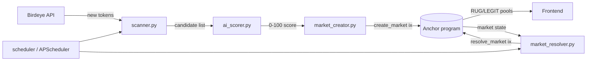

# RugRoulette

[](https://solana.com)
[](https://www.anchor-lang.com/)
[](https://python.org)
[](LICENSE)

> **Prediction market for rug pull detection on Solana.**  
> Bet on whether a newly launched token is a RUG or LEGIT — win SOL from the losing side.

---

## The Problem

Every day, hundreds of new tokens launch on Solana. Many of them are rug pulls — the developers drain liquidity within days, leaving buyers with worthless tokens. There's no reliable way for average users to:

- **Identify rugs before they happen** (public tools are slow or paywalled)
- **Profit from their market knowledge** (you either buy the token or don't — no middle ground)
- **Crowdsource intelligence** on suspicious tokens

## The Solution

RugRoulette turns rug detection into a prediction market. Instead of buying a suspicious token, you **bet on whether it will rug**. If you're right, you win SOL from those who bet the other way.

An automated pipeline scans new tokens, scores them with AI, creates markets, and resolves them after 7 days using on-chain data.

---

## How It Works

```
1. New token appears on Solana
       │
2. Crank scanner detects it (Birdeye API + liquidity filter)
       │
3. AI scorer rates rug probability (Claude API + heuristics)
       │
4. Prediction market created on-chain (Anchor program)
       │
5. Users bet: RUG or LEGIT (SOL as collateral)
       │
6. After 7 days → resolver checks:
   • Price dropped >90%?    → RUGGED
   • Liquidity vanished?    → RUGGED
   • Dev sold everything?   → RUGGED
   • Otherwise              → SURVIVED
       │
7. Winners split the losing pool (minus 3% protocol fee)
```

---

## Architecture

```
┌─────────────────────────────────────────────────────────────────┐
│                         RugRoulette                             │
├──────────────┬─────────────────────┬────────────────────────────┤
│   Frontend   │   Smart Contract    │      Python Crank          │
│              │                     │                            │
│  Vite+React  │  Anchor 1.0 (Rust) │  Scanner → AI Scorer       │
│  DaisyUI     │                     │  Market Creator            │
│  Zustand     │  4 accounts:        │  Market Resolver           │
│  Fira Code   │  • MarketFactory    │                            │
│              │  • PredictionMarket │  Birdeye API               │
│  Pages:      │  • UserBet          │  Claude API (scoring)      │
│  • Markets   │  • UserProfile      │  APScheduler (cron)        │
│  • Detail    │                     │                            │
│  • Profile   │  8 instructions:    │  Solana RPC for on-chain   │
│  • Leader    │  • initialize_factory│  tx submission             │
│    board     │  • create_market    │                            │
│              │  • place_bet        │                            │
│  Wallet:     │  • resolve_market   │                            │
│  Phantom     │  • claim_winnings   │                            │
│  Solflare    │  • claim_refund     │                            │
│              │  • cancel_market    │                            │
│              │  • update_ai_score  │                            │
└──────────────┴─────────────────────┴────────────────────────────┘
```

---

## Features

- [x] Auto-detect new token launches via Birdeye API
- [x] AI rug probability scoring (Claude + heuristic fallback)
- [x] On-chain prediction markets (RUG vs LEGIT)
- [x] 7-day resolution with on-chain proof (price, liquidity, dev activity)
- [x] Winner payout distribution (proportional to bet size)
- [x] User profiles with win rate, streaks, and earnings
- [x] Leaderboard with sortable rankings
- [x] Market search, filter, and sort
- [x] Auto-refresh market data (30s polling)
- [x] Cancellation + refund flow for invalid markets

---

## Screenshots

### Market Grid
Live prediction markets with AI scores, pool distribution bars, and countdown timers.

### Market Detail
Full pool breakdown, bet panel with quick-select amounts, and claim flow for winners.

### Leaderboard
Top predictors ranked by earnings, win rate, bet count, or best streak.

---

## Getting Started

### Prerequisites

- Node.js 18+
- Rust + Anchor CLI 1.0
- Python 3.10+
- Solana CLI (configured for devnet)

### Smart Contract

```bash
anchor build
anchor deploy --provider.cluster devnet
```

Program ID: `3AKQmuMpZAMUiKm4pRw1BXFaUzFhx65Pi5XSBoBvkomC`

### Frontend

```bash
cd app
npm install
cp .env.example .env   # set VITE_PROGRAM_ID and VITE_RPC_URL
npm run dev
```

Opens at `http://localhost:5173`

### Python Crank

```bash
cd crank
pip install -r requirements.txt
cp ../.env.example .env  # set PROGRAM_ID, RPC_URL, BIRDEYE_API_KEY, ANTHROPIC_API_KEY
python main.py
```

The crank runs three jobs:
- **Scanner** — checks for new tokens every 5 minutes
- **AI Scorer** — rates each token's rug probability
- **Resolver** — resolves expired markets every 60 minutes

### Environment Variables

| Variable | Required | Description |
|----------|----------|-------------|
| `VITE_PROGRAM_ID` | Yes | Deployed Anchor program address |
| `VITE_RPC_URL` | Yes | Solana RPC endpoint (Helius recommended) |
| `PROGRAM_ID` | Yes (crank) | Same program address |
| `RPC_URL` | Yes (crank) | Solana RPC for crank transactions |
| `BIRDEYE_API_KEY` | No | Birdeye API for token data (falls back to mock) |
| `ANTHROPIC_API_KEY` | No | Claude API for AI scoring (falls back to heuristic) |
| `CRANK_KEYPAIR_PATH` | No | Path to crank authority keypair (default: Solana CLI default) |

---

## Fee Structure

- **3% protocol fee** deducted from the losing pool on market resolution
- Fee is capped at losing pool size (prevents underflow)
- Winners receive: their bet back + proportional share of remaining losing pool

---

## Security

- All arithmetic uses `checked_*` operations (no overflow)
- No `.unwrap()` in on-chain code — all errors use custom `ErrorCode` enum
- PDA bumps stored and reused (not recalculated)
- CEI pattern: state updates before CPI calls
- Signer checks + account constraints on all instructions
- One bet per user per market enforced via PDA uniqueness

---

## Tech Stack

| Layer | Technology |
|-------|-----------|
| Smart Contract | Anchor 1.0 (Rust) |
| Frontend | Vite + React 19 + DaisyUI + Zustand |
| Crank | Python 3 + APScheduler + solders |
| AI Scoring | Claude API (Anthropic) |
| Token Data | Birdeye API |
| Wallet | Phantom, Solflare |
| Network | Solana Devnet |

---

## Local Development

A complete loop on your laptop, no shared infra required.

```bash
# 1. clone + install deps in three places
git clone https://github.com/vivekraj88/rugroulette.git
cd rugroulette
anchor build                       # builds the program
cd app && npm install && cd ..     # frontend deps
cd crank && pip install -r requirements.txt && cd ..

# 2. spin a localnet (in a separate terminal)
solana-test-validator --reset

# 3. fund + deploy the program against localnet
solana airdrop 5
anchor deploy --provider.cluster localnet

# 4. seed a few demo markets via the crank (one-shot mode)
cd crank && python main.py --once

# 5. start the frontend
cd app && npm run dev
```

Visit `http://localhost:5173/app/markets` and connect a localnet-funded wallet. Bets, claims, and resolutions all stay local.

---

## Architecture (data flow)



The crank's three jobs share `created_markets.json` so a restart picks up where the previous run left off.

---

## FAQ

**How is "rug" determined?**
Three signals at resolution time, evaluated against the market's snapshot at creation: (1) price dropped more than 90 %; (2) liquidity drained below the floor; (3) the deployer wallet sold their entire position. Hitting any one of those three flips the market to `RUGGED`. Otherwise it resolves `LEGIT`.

**What if the market can't be resolved (oracle silent, token delisted)?**
The factory authority can call `cancel_market`, which halts new bets and switches the market to a refund-eligible state. Both sides reclaim their stake via `claim_refund` — no winner, no fee taken.

**Is there a protocol fee?**
Yes — 3 % of the losing pool is sent to the factory treasury before payouts are split among winners. Refund cancellations take **no** fee.

**Why devnet only?**
Token data feeds (Birdeye, on-chain price oracles) lag less on mainnet, but rug-pull simulation on real funds is irresponsible. Devnet keeps the experimentation honest while the resolver heuristics get hardened.

**Can I run my own crank?**
Yes — the program permits anyone to call `resolve_market` after `resolve_at`. Set `RPC_URL` + `WALLET_PATH` in your `.env` and run `python main.py`. Multiple crankers racing to resolve is fine; the program is idempotent on a `Resolved` market.

---

## License

MIT
